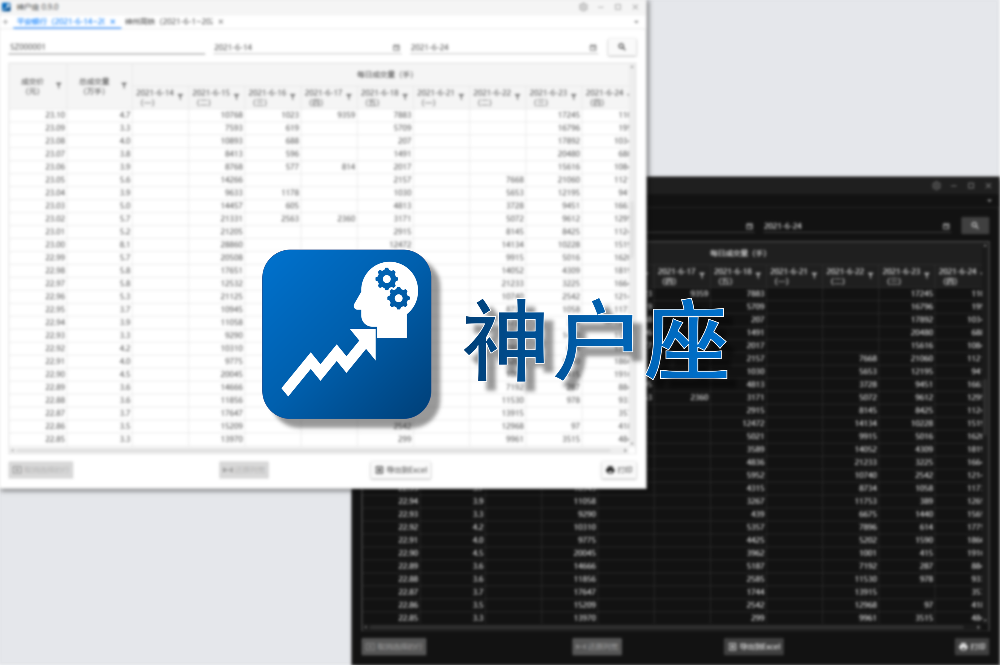

# 神户座

[English](./README.md) | **简体中文**

**_（此仓库已归档。建议移步[这里](https://github.com/ArvinZJC/Kobe)体验全新的神户座。）_**

神户座是一个 Windows 应用程序，它主要用来帮助用户搜索成交价和成交量，可看作是对分价表的组合加工。“神户”玩儿的是谐音梗，指代“沪深”。“沪深”的意思就不多说了，懂的都懂。这款应用程序实现的功能算不上太复杂，设计的目的主要是为了满足一些中国大陆用户的需求（包括家人），因而此应用程序支持的语言仅有简体中文。请注意此项目使用 [GPL-3.0 协议](./LICENSE)。

## 注意

1. 应用程序配置文件和相应的更新日志可在[发行](../../releases)部分找到。从 [V0.3.0](../../releases/tag/v0.3.0) 开始，此项目采用了一个全新的打包方案，制作出来的应用程序配置文件功能体系更全，体积更小，也因此**从低于 V0.3.0 的版本升级时必须手动卸载旧版本**。
2. 应用程序支持 **Windows 7/8/8.1/10/11**，它在 Windows 11 上的表现还在优化验证中。

## 文件夹说明

### [ShSzStockHelper](./ShSzStockHelper)

这是 Visual Studio 解决方案的文件夹，里面包含了应用程序运行的代码和资源。

### [ShSzStockHelper_Setup](./ShSzStockHelper_Setup)

这是 Advanced Installer 项目的文件夹，用于制作界面友好的 EXE 格式的应用程序配置文件（沪深小助手的安装、修改、卸载）。

### [ShSzStockSymbolNameData](./ShSzStockSymbolNameData)

这个文件夹包含了一个 Jupyter Notebook 文件，其中用 Python 代码实现了查询沪深股票代码和相应的股票名称，并将它们保存在一个 JSON 格式的文件中。这个数据文件是应用程序资源的一部分。

更多信息请参见各文件夹的 README。
