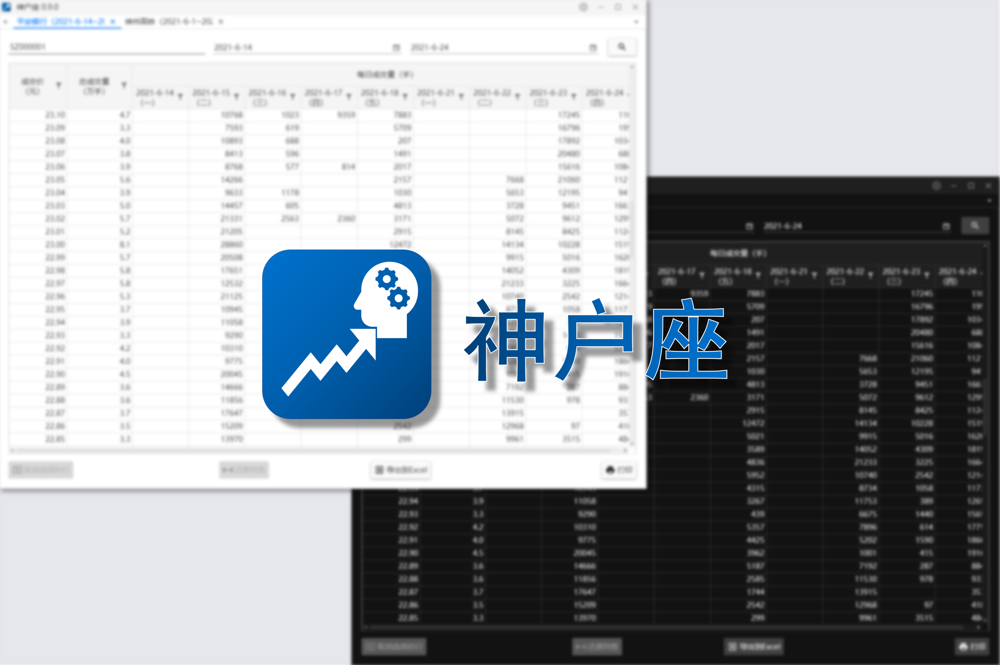

# SH/SZ Stock Helper

**English** | [简体中文](./README-zhCN.md)

**_(This repository has been archived. You are suggest to move [here](https://github.com/ArvinZJC/Kobe) for the brand-new Kobe.)_**

SH/SZ Stock Helper is a Windows app that can mainly search strike prices and volumes for users. Here SH represents Shanghai Stock Exchange, while SZ means Shenzhen Stock Exchange. The app is primarily designed for a specified part of Chinese users, and contents are displayed in simplified Chinese. Please note that the code is licensed under [the GPL-3.0 License](./LICENSE).

## ATTENTION

1. The setup EXE files and the corresponding changelogs can be found in the [Releases](../../releases) section. From [V0.3.0](../../releases/tag/v0.3.0), a totally new solution to build the setup file is applied to make it more powerful (but with a smaller size) and **any version older than V0.3.0 should be manually uninstalled**.
2. The app supports **Windows 7/8/8.1/10/11**, although the performance on Windows 11 is still under improvement and validation.

## Folder Instructions

### [ShSzStockHelper](./ShSzStockHelper)

This is the Visual Studio solution folder of the app. It contains code and resources for the app to run.

### [ShSzStockHelper_Setup](./ShSzStockHelper_Setup)

This is the Advanced Installer project folder. The files in the folder are mainly used to build the latest app setup file (.exe) with user-friendly UI.

### [ShSzStockSymbolNameData](./ShSzStockSymbolNameData)

This folder contains a Jupyter Notebook file with Python code to retrieve and store a list of symbols and corresponding names of SH/SZ stocks in a JSON file which is a part of the resources of the app.

For more information, please refer to the README file in each folder.
