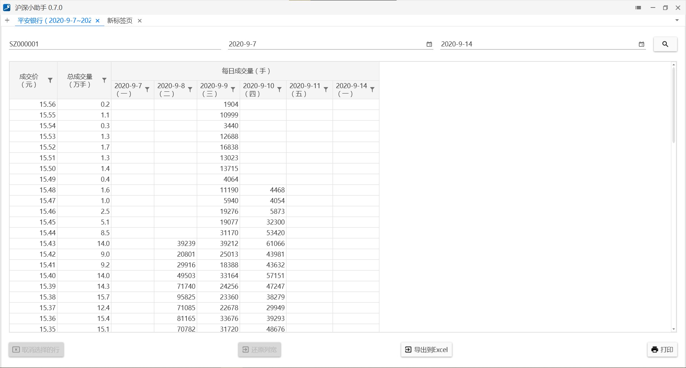
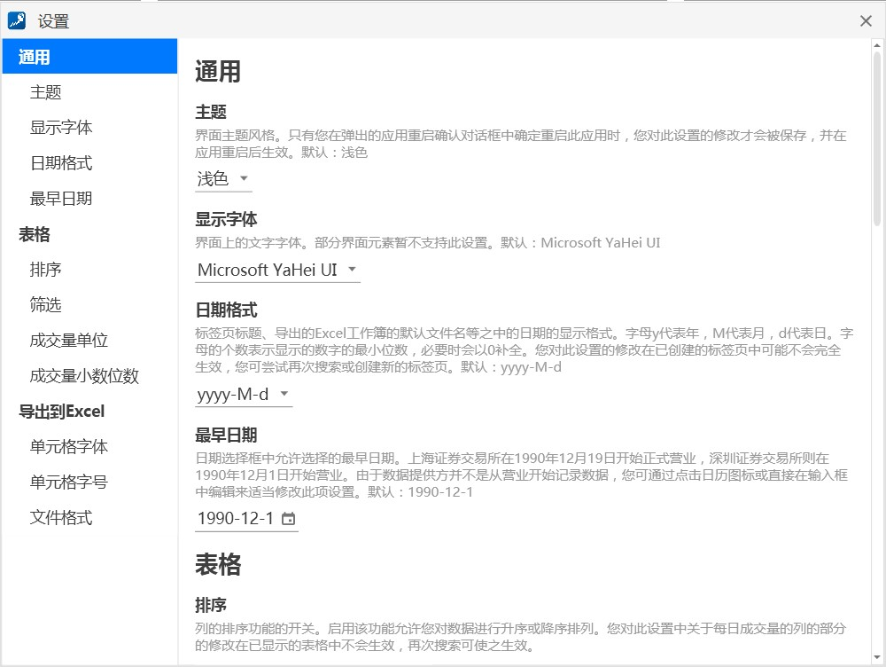
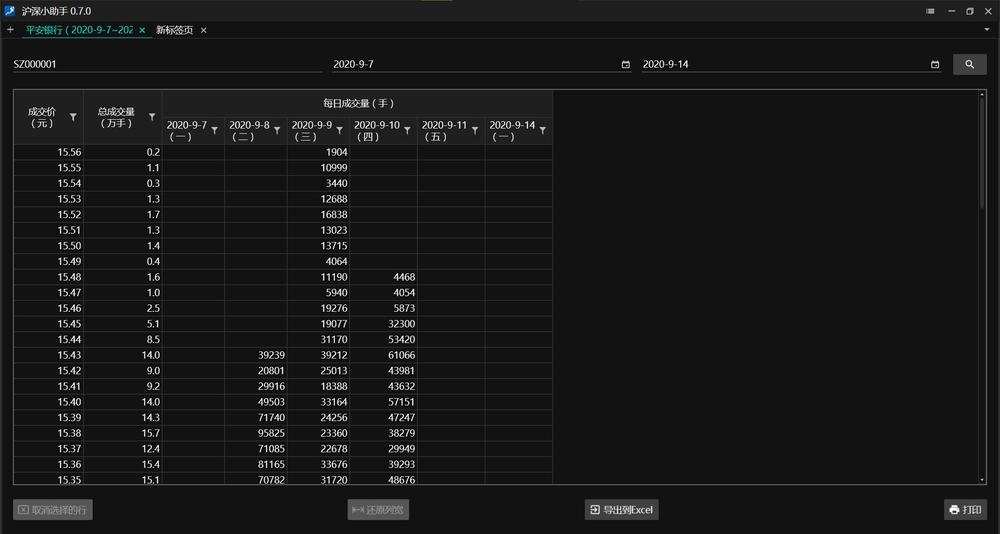
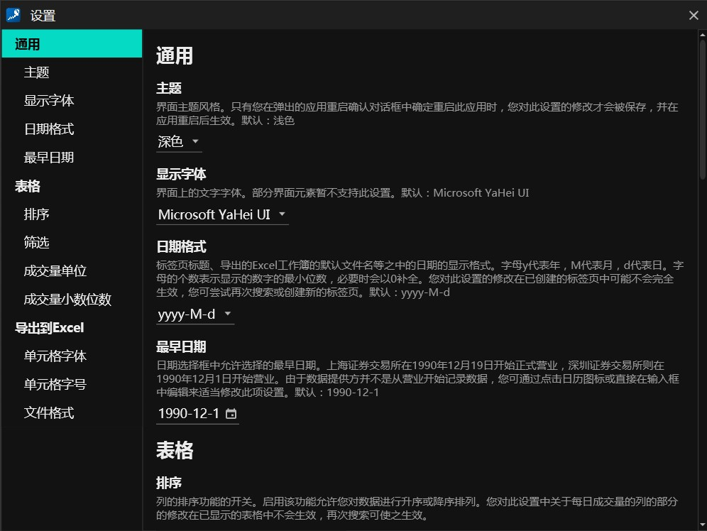

# [ShSzStockHelper-Windows](https://github.com/ArvinZJC/ShSzStockHelper-Windows)/ShSzStockHelper

[English](https://github.com/ArvinZJC/ShSzStockHelper-Windows/blob/master/ShSzStockHelper/README.md) | **简体中文**

这是Visual Studio解决方案的文件夹，里面包含了应用程序运行的代码和资源。应用程序的主要功能如下：

1. 可通过沪深股票代码、开始日期和结束日期查询时间段内的成交价和成交量。（数据查询通过应用网络爬虫实现。）
2. 在查询到的数据表上，可排序和筛选。
3. 查询到的数据表可导出到XLS或XLSX格式的Excel文件中，还可打印（打印预览窗口提供必要的打印设置）。
4. 用户可根据自己的喜好设置主题、字体、功能等。

## 用户界面示例

示例1:

示例2:

示例3:

示例4:

## 注意

1. 截至2020年12月16日，使用Visual Studio 2019和.NET Core 3.1开发表现良好。此外，我要特别感谢Syncfusion提供的[强大的WPF的UI组件库](https://www.syncfusion.com/wpf-ui-controls)，这节省了许多开发时间。
2. 图标资源（除应用程序图标）均来自[Material Design图标库](https://material.io/resources/icons/?style=baseline)和[Flaticon](https://www.flaticon.com/)。
3. 应用用到的主要的NuGet包参见下面的表格。

    | 名称 | 版本 |
    | :-- | :--: |
    | [HtmlAgilityPack](https://html-agility-pack.net/) | 1.11.28 |
    | [Newtonsoft.Json](https://www.newtonsoft.com/json) | 12.0.3 |
    | [PortableSettingsProvider](https://github.com/Bluegrams/SettingsProviders) | 0.2.4 |
    | Syncfusion.DataGridExcelExport.Wpf | 18.3.0.53 |
    | Syncfusion.SfBusyIndicator.WPF | 18.3.0.53 |
    | Syncfusion.SfGrid.WPF | 18.3.0.53 |
    | Syncfusion.SfInput.WPF | 18.3.0.53 |
    | Syncfusion.SfTreeNavigator.WPF | 18.3.0.53 |
    | Syncfusion.Themes.MaterialDark.WPF | 18.3.0.53 |
    | Syncfusion.Themes.MaterialLight.WPF | 18.3.0.53 |
    | Syncfusion.Tools.WPF | 18.3.0.53 |
