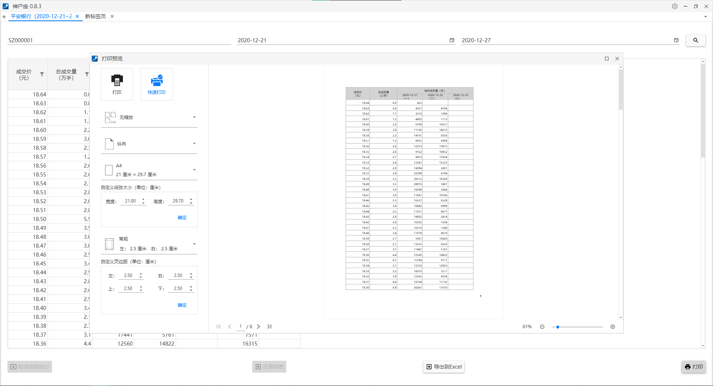
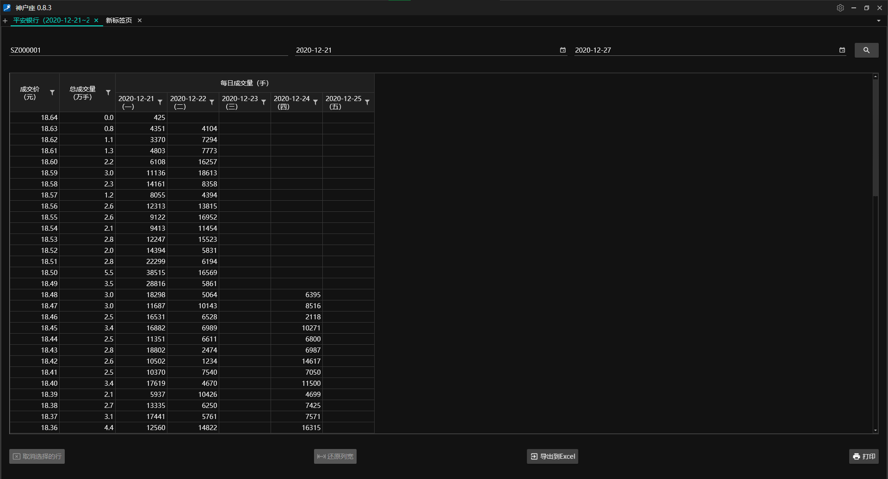
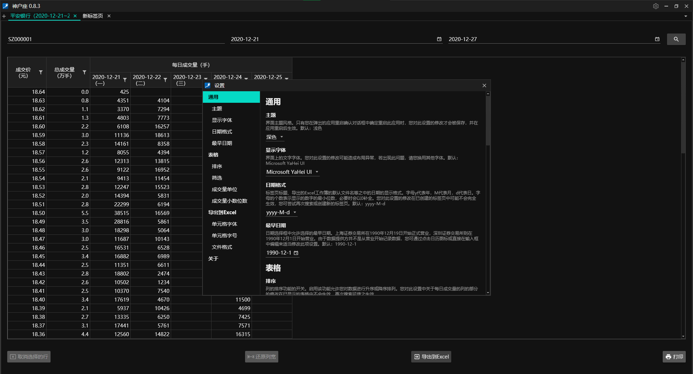

# [ShSzStockHelper-Windows](../../..)/ShSzStockHelper

**English** | [简体中文](./README-zhCN.md)

This is the Visual Studio solution folder of the application. It contains code and resources for the application to run. The major features of the application are listed as follows.

1. Enable searching strike prices and volumes by the symbol of an SH/SZ stock, the start date, and the end date. (Data is retrieved by implementing a basic web crawler.)
2. Allow sorting and filtering on the columns of the table containing data of strike prices and volumes.
3. The data retrieved can be exported to an Excel file (.xls/.xlsx), and it is also available to be printed. A print preview window with printing settings will be displayed.
4. The preferences for themes, fonts, functionality, etc. can be changed by the user.

## ATTENTION

1. By 23 February 2021, everything looks good with Visual Studio 2019 (Version: 16.8.4) + Windows Presentation Foundation (WPF) with .NET Core 3.1. Additionally, I would like to thankfully acknowledge Syncfusion for [its powerful WPF UI controls and libraries](https://www.syncfusion.com/wpf-ui-controls), which save much development time.
2. Most of icon images used by the application are from [Material Design Icons](https://material.io/resources/icons/?style=baseline) and [Flaticon](https://www.flaticon.com/).
3. The main NuGet packages used in the application are listed in the following table.

    | Name | Version |
    | :-- | :--: |
    | [HtmlAgilityPack](https://html-agility-pack.net/) | 1.11.29 |
    | [Newtonsoft.Json](https://www.newtonsoft.com/json) | 12.0.3 |
    | [PortableSettingsProvider](https://github.com/Bluegrams/SettingsProviders) | 0.2.4 |
    | Syncfusion.DataGridExcelExport.Wpf | 18.4.0.34 |
    | Syncfusion.SfBusyIndicator.WPF | 18.4.0.34 |
    | Syncfusion.SfGrid.WPF | 18.4.0.34 |
    | Syncfusion.SfInput.WPF | 18.4.0.34 |
    | Syncfusion.SfTreeNavigator.WPF | 18.4.0.34 |
    | Syncfusion.Themes.MaterialDark.WPF | 18.4.0.34 |
    | Syncfusion.Themes.MaterialLight.WPF | 18.4.0.34 |
    | Syncfusion.Tools.WPF | 18.4.0.34 |

## Partial UI (For Reference Only)

UI 1:

UI 2:

UI 3:

UI 4:

UI 5:

UI 6:

