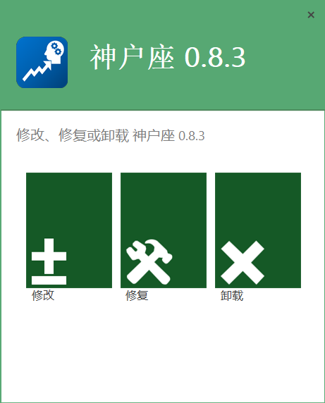

# [ShSzStockHelper-Windows](../../..)/ShSzStockHelper_Setup

[English](./README.md) | **简体中文**

这是Advanced Installer项目的文件夹，用于制作界面友好的EXE格式的应用程序配置文件（沪深小助手的安装、修改、卸载）。

## 注意

1. 截至2021年2月23日，使用Advanced Installer 18.3开发表现良好。我要特别感谢这款非常有帮助的打包工具，它使得沪深小助手的EXE格式的配置文件拥有良好的表现。
2. 此Advanced Installer项目的类型是“**Architect**”。

## 用户界面示例

示例1:

示例2:

