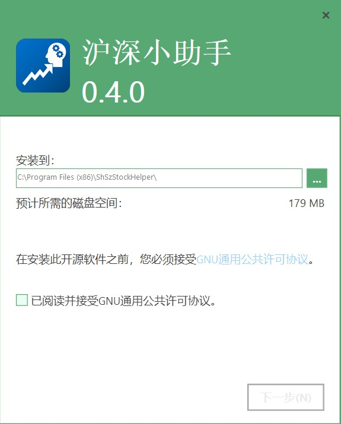
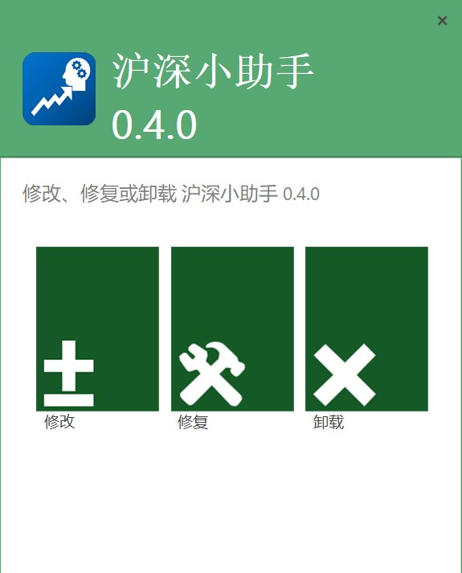

# [ShSzStockHelper-Windows](https://github.com/ArvinZJC/ShSzStockHelper-Windows)/ShSzStockHelper_Setup

This is the Advanced Installer project folder of the application setup file. The files in the folder are mainly used to build the latest application setup file (.exe) with user-friendly UI. The setup file can install/modify/uninstall the application on the computer.

## Partial UI

Figure 1
Figure 2

## ATTENTION

1. By 15 September 2020, everything looks good with Advanced Installer 17.3. I would greatly show my appreciation of this handful setup tool which improves the performance of the application setup file.

2. The type of this installer project is **Architect**.
