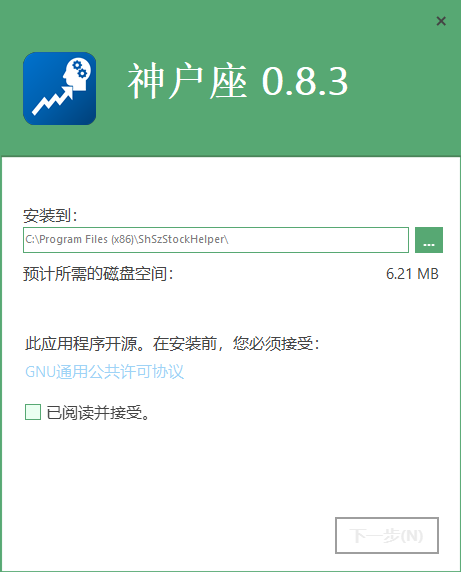

# [ShSzStockHelper-Windows](../../..)/ShSzStockHelper_Setup

**English** | [简体中文](./README-zhCN.md)

This is the Advanced Installer project folder of the app setup file. The files in the folder are mainly used to build the latest app setup file (.exe) with user-friendly UI. The setup file can install/modify/uninstall the app on the computer.

## ATTENTION

1. By 23 February 2021, everything looks good with Advanced Installer 18.3. I would greatly show my appreciation of this handful setup tool which improves the performance of the app setup file.
2. The type of this installer project is **Architect**.

## Partial UI (For Reference Only)

UI 1:

UI 2:

